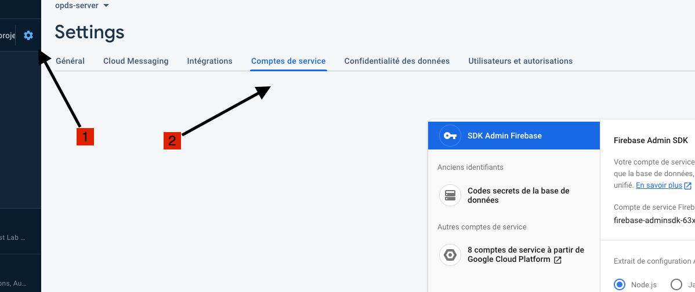
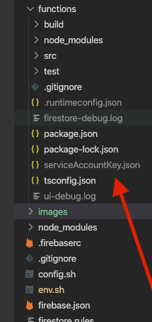

# opds-server-firebase

readium OPDS2 publication server built on Google Firebase backend.

The aims of this project is to bootstrap this server to make your own ODPS2 server.
It's useful for any editor wishing broadcast his publication to a readium standard format [opds2](https://drafts.opds.io/opds-2.0).
It's also useful to create your personnal publication server usable together with [Thorium reader](https://www.edrlab.org/software/thorium-reader/) for example.

### why firebase

I choose to used firebase to simply deploy the server on the web.

Traditionally when we built a server, we need to deals with the code logic (javascript, php) and the hosting infrastructure  (devops) like http server, reverse proxy, cdn, authentification server, ssl and database. It's heavy to manage it at the beginning but also during the entire hosting life.

With firebase, Google, offers to manage all devops environment but also the backend himself. We have just to care about code. nothing else.

To create an API REST google called it the Cloud Functions in firebase : https://firebase.google.com/docs/functions
> Cloud Functions for Firebase is a serverless framework that lets you automatically run backend code in response to events triggered by Firebase features and HTTPS requests.

### price

When we deploy the server to firebase, to used it in production, you have to apply to the 'blaze plan'.
This plan unlock the billing.

The price to used this server is free for a private or limit used. Maybe several hundred of publication hosted in the application with the same number of monthly users. In case of high demand the price will stay low.
You can see the price of each firebase features. https://firebase.google.com/pricing.

### firebase architecture used

- Clood functions
- firestore
- storage
- authentification (not yet implemented)

the main entry point is the https request.

### full text search

firebase doesn't provide any full text search on his DB firestore. It advices to use [algolia](https://www.algolia.com)

https://firebase.google.com/docs/firestore/solutions/search

To use algolia we need to create an account in their website. Algolia is free up to a limit but like firebase, the limit is high.

## bootstrap this project

if you want personalise the server. You have just to fork it and make your changes. This project is a foundation to personalise your own OPDS2 feed.


## setup

### create a project

create a [firebase](https://console.firebase.google.com) project

#### the project uses 3 firebase features :

- Functions
- firestore : realTime database (enable it !)
- storage : file storage (enable it with an empty "publication" bucket)

### firebase CLI 

https://firebase.google.com/docs/cli/

    npm install -g firebase-tools

#### login with your google account

    firebase login

#### init the project in your computer

    firebase init

follow the guide

### authentification

to link your project with firebase, you need a private key generated by the firebase console: 

https://firebase.google.com/docs/admin/setup?authuser=0



and click on 'generate a new key'

download the file in /functions and rename it "serviceAccountKey.json" .. Be carefull, it's important in codebase to respect the filename.

> it's not tracked by git



### setting up the global env

in a shell :

    source env.sh

and check if GOOGLE_APPLICATION_CREDENTIALS is set :

    env | grep "GOO"


### firebase config key

setup the configuration key of the name of your server and algolia
text indexer services.

in `config.sh` file tunes this parameter:
```

firebase functions:config:set server.port=80
firebase functions:config:set server.name="opds-server"
firebase functions:config:set server.domain="my-domain"
firebase functions:config:set server.protocol="https"
firebase functions:config:set server.path=""


firebase functions:config:set algolia.appid=""
firebase functions:config:set algolia.apikey=""
firebase functions:config:set algolia.enabled="false" # true or false

```

and then execute it

    ./config.sh

### once all is configured

### you can simulate it in your computer (localhost)

    firebase emulators:start

### and you can simply deploy it in firebase server

    firebase deploy


## documentation

the server has 5 API entry points :

- 3 http routes with CRUD operations
    - /publication
    - /webpub
    - /storage
- 1 http route to publish the OPDS2 feed
    - /feed
- 1 experimental http route to parse and save en epub file
    - /generate

### /publication

Create, Read, Update and Delete an [OPDSPublication](https://drafts.opds.io/opds-2.0#41-opds-publication)

An OPDS feed is composed with several OPDSPublication

### /webpub

Create, Read, Update and Delete a [Readium Wepub Publication Manifest](https://github.com/readium/webpub-manifest)

this http route allow to serve a webpub manifest without include it in an opdsFeed.
A readium web publication manifest can't be added in an opdsFeed. It's should be converter and linked inside an OPDSPublication before publish it in the opds feed.

### /storage

Create, Read, Update and Delete a file. The file is saved inside a google firebase storage bucket
https://firebase.google.com/docs/storage/

### /feed

returns an [opds feed](https://drafts.opds.io/opds-2.0)

close to the same behaviour of the feedbooks API https://catalog.feedbooks.com/catalog/index.json

main features:
- search: keep the query param navigation on search request
- handle [facets](https://drafts.opds.io/opds-2.0#14-facets)
- handle [groups](https://drafts.opds.io/opds-2.0#15-groups)
    - 2 default groups:
        - most downloaded ( not link yet with the /store route )
        - most recent
        - [subject](https://github.com/readium/webpub-manifest/tree/master/contexts/default#subjects) in metadata
- handle [navigation](https://drafts.opds.io/opds-2.0#11-navigation)


### /generate

Experimental developement to parse and save an epub file.

- parse the epub :
- extract the cover
- generate an OPDSPublication
- save the cover and the epub file in cloud storage
- fill the publication with download link and save it in database

## API Reference :

- /publication/{id}
    - POST : save the publication in database
        - body: 'publication': [OPDSPublication](https://drafts.opds.io/opds-2.0#41-opds-publication)
    - PUT : update the publication in database
        - body: 'publication' : [OPDSPublication](https://drafts.opds.io/opds-2.0#41-opds-publication)
    - DELETE : delete the publicatio in database
    - GET : get the publication
        - no query and no body : returns an array of all publications in database
- /webpub/{id}
    - POST : save the webpub in database
        - body: 'webpub' : [R2Publication](https://github.com/readium/webpub-manifest)
    - PUT : update the webpub in database
        - body: 'webpub' : [R2Publication](https://github.com/readium/webpub-manifest)
    - DELETE : delete the RWPManifest in db 
    - GET : get the webpub
        - no query and no body : returns an array of all webpubs in database
- /storage/{id}
    - POST : save the file in web storage
        - query : 'filename' : string name of the file
        - body : file binary
    - DELETE: remove the file from web storage
- /feed
    - GET : get the odps2 feed
- /generate
    - POST: parse and save an epub to the db and the web storage
        - query : 'filename' : string name of the file
        - body : file binary
    - DELETE: remove the publication from web storage and db
        - query : 'id' : string id of the publication


## lexique

[OPDSPublication](https://drafts.opds.io/opds-2.0#41-opds-publication) = publication OPDS2

[R2Publication](https://github.com/readium/webpub-manifest) = Readium Webpub Publication Manifest

## test

    npm run test


## need improvement

- Improve the epub parser
    - bug on DELETE route
    - support audiobook, lpf, ...
- authentification not implemented
- deploy and create an edrlab OPDSFeed
- create and manage new test